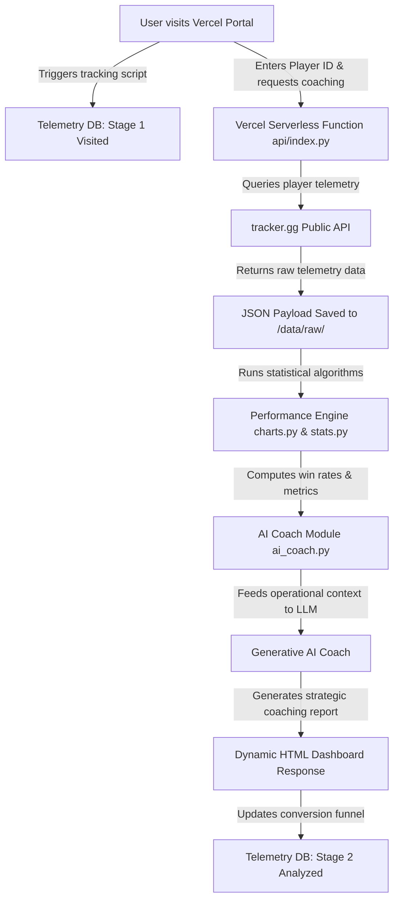

# R6 Esports Analytics & AI-Driven Coaching Platform

[](https://siege-analytics-coach.vercel.app)
[](https://www.python.org)
[](https://fastapi.tiangolo.com)
[](https://deepmind.google)

A production-grade, serverless data analytics and AI-driven coaching portal for competitive *Rainbow Six Siege* players. Deployed on **Vercel** as a serverless Python FastAPI application, the platform ingests live telemetry, computes advanced player performance statistics, logs conversion funnels, and serves automated cognitive coaching plans generated by Generative AI.

**Live Web Application:** [https://siege-analytics-coach.vercel.app](https://siege-analytics-coach.vercel.app)

---

## 🗺️ System Architecture & Data Flow



---

## 🛠️ Core Features

### 1. Serverless Python Backend (FastAPI on Vercel)
* Wrapped standard Python FastAPI routes into Vercel Serverless Functions (`api/index.py` using `@vercel/python`).
* Direct route handling allows high-speed, asynchronous request processing without maintaining virtual machine infrastructure.

### 2. Live Telemetry Scraper & Data Pipeline
* Ingests real-time player records (MMR history, operator pick rates, kill/death ratios, map performance) from public tracker APIs.
* Converts raw JSON payloads into operational databases, caching statistics to minimize rate limits.

### 3. AI Cognitive Coach (`ai_coach.py`)
* Leverages LLMs to digest raw quantitative metrics (e.g., high-risk operator profiles or low defense map pick frequencies).
* Formulates structured, map-specific operational suggestions, weapon counter-picks, and playstyle recommendations.

### 4. Telemetry Tracking & Conversion Funnels
* Built-in funnel analytics tracking user steps:
  * **Stage 1 (Visited Portal):** Initial page loads and device diagnostics.
  * **Stage 2 (Analyzed Player):** Successful player reports generated.
* Collects anonymous operational statistics to optimize user acquisition and engagement loops.

---

## 📂 Project Structure

```
siege-analysis/
├── api/
│   └── index.py               # Vercel entrypoint wrapping the FastAPI app
├── data/
│   └── raw/                   # Telemetry JSON caches
├── output/
│   └── reports/               # Markdown/HTML coaching files
├── ai_coach.py                # LLM operational prompt structures & cognitive agent
├── charts.py                  # Pyplot/Matplotlib visualization modules
├── stats.py                   # Win-rate calculations and telemetry processors
├── portal_preview.html        # Front-end responsive portal interface
├── vercel.json                # Vercel Serverless routing config
└── requirements.txt           # Python application dependencies
```

---

## 🚀 Local Installation & Setup

### 1. Clone the Repository
```bash
git clone https://github.com/Amlenk/siege-analytics-coach.git
cd siege-analytics-coach
```

### 2. Install Dependencies
```bash
pip install -r requirements.txt
```

### 3. Environment Variables
Create a `.env` file in the root directory and add your API Keys:
```env
TRACKER_GG_API_KEY=your_tracker_gg_api_key_here
GEMINI_API_KEY=your_gemini_api_key_here
```

### 4. Run the API Locally
```bash
uvicorn api.index:app --reload
```
Open your browser to `http://127.0.0.1:8000` to interact with the local development portal.
