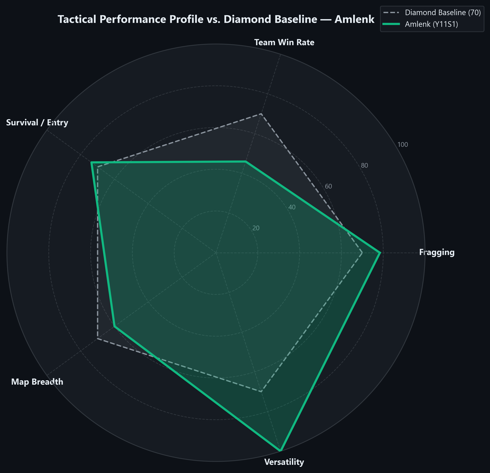
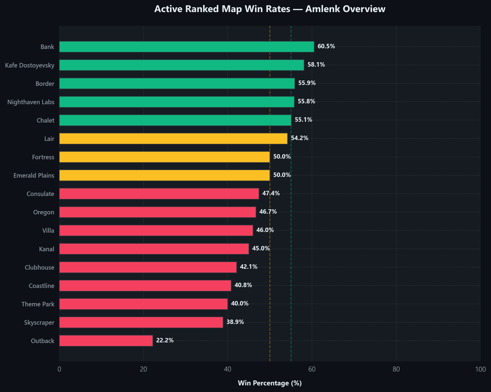
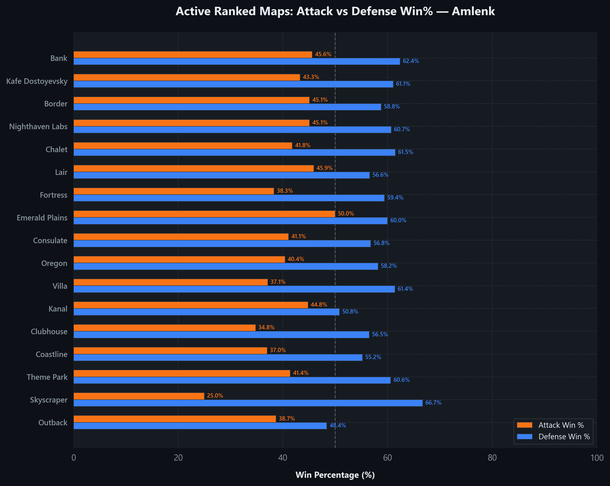
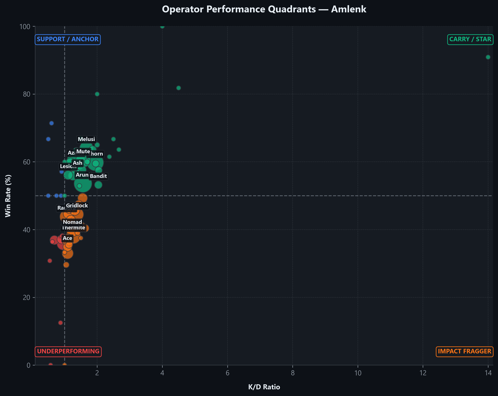
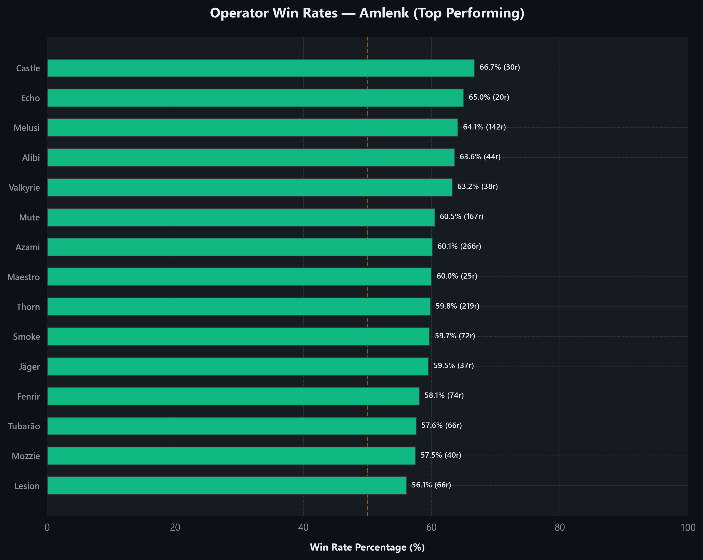
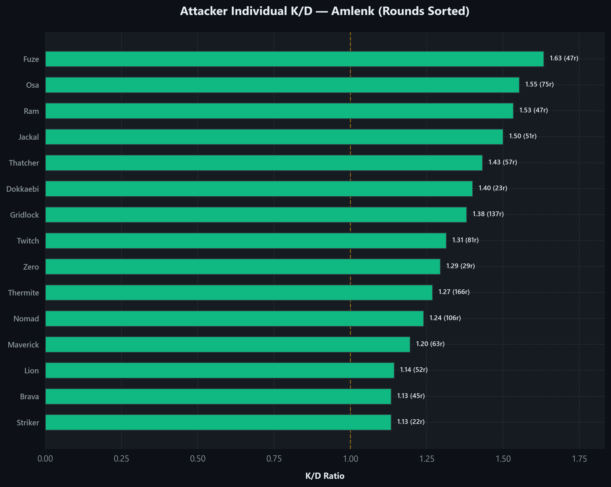
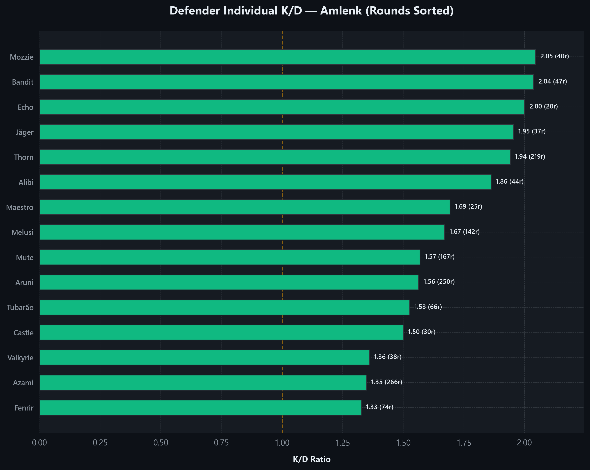
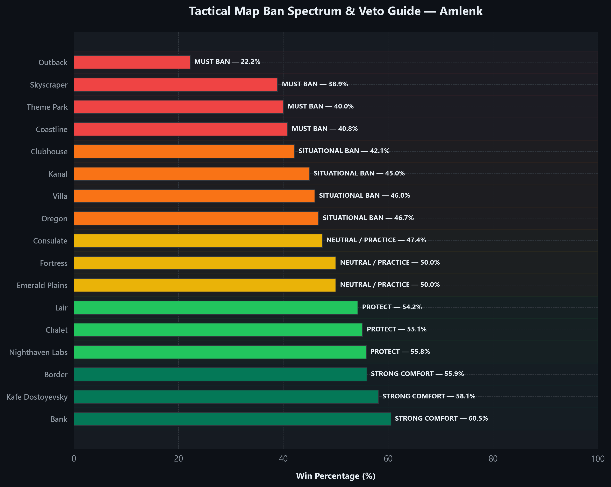

# Rainbow Six Siege Elite Coaching Report (Y11S1)

**Prepared For:** `FearlessCoppeR`
**Ubisoft Platform:** `UPLAY`
**Generated On:** 2026-06-01
**Coaching Standing:** `Diamond 1 Peak Solo-Flex Entry (Lifetime Overall Audit)`

---

### SECTION 1: PERFORMANCE SNAPSHOT

# 🏆 ELITE COMPETITIVE TACTICAL DIAGNOSIS: THE CLIMB OF FearlessCoppeR

FearlessCoppeR's seasonal competitive campaign represents a highly structured effort in competitive ranking. Across a total of **420 rounds** played, they have achieved an individual K/D of **1.10** and a win rate of **51.1%**, operating as a critical force in the competitive hierarchy of their team.

Their tactical profile is defined by `Diamond 1 Peak Solo-Flex Entry (Lifetime Overall Audit)`, showing clear mechanical peaks and distinct coordination challenges. In the lobbies of Ranked 2.0, mechanical carries alone hit a structural wall. An executive tactical analysis reveals a key opportunity: FearlessCoppeR's lifetime stats represent a highly experienced and high-ceiling tactical veteran. Historically securing Diamond 1 with 4,437 RP and holding a lifetime 1.10 K/D ratio across 6,255 Ranked matches, FearlessCoppeR possesses elite-level individual combat mechanics. This individual audit examines lifetime metrics to establish structured solo/flex climbing routines, independent of standard stack play.

**SEASON OBJECTIVE:** Optimize solo/flex impact by leveraging deep lifetime map knowledge, maximizing individual utility value, and utilizing high-lethality combat mechanics to secure opening round picks.

#### 🛡️ COMPETITIVE RANK HISTORY OVERVIEW
* **Current Rank (Y11S1):** `SILVER 5 (2,042 RP)`
* **Lifetime Highest Rank 2.0 (Ranked 2.0 peak):** `DIAMOND 1 (4,437 RP)`
* **Lifetime Highest Rank 1.0 (Rank 1.0 peak):** `PLATINUM 2 (3,681 MMR)`

---

### SECTION 2: TREND ANALYSIS — Y11S1 vs Lifetime

A precise comparison between FearlessCoppeR's seasonal statistics and their Lifetime performance highlights progression paths and coordination gaps:

| Performance Metric | Seasonal Scope | Lifetime Overall | Exact Delta | Progress Verdict |
| :--- | :---: | :---: | :---: | :--- |
| **Kill/Death Ratio (K/D)** | **1.10** | 1.10 | **+0.00** | Maintaining stable fragging power under competitive pressure. |
| **Win Rate (WR)** | **51.1%** | 51.1% | **+0.0%** | Clear indication of stack execute and round conversion efficiency. |
| **Ranked RP Tier** | **2,042 RP (SILVER 5)** | Level 847 | Delta: +150 RP | Standing confirmed in the highly competitive bracket. |

**TACTICAL INSIGHT:** The seasonal win rate of 51.1% represents an exact delta of +0.0% compared to lifetime performance, confirming that individual combat mechanics (K/D: 1.10) must be integrated into team support systems. In Ranked 2.0, round conversion is the ultimate metric of success.

---

### SECTION 3: MAP MASTERY MATRIX

Below is the complete audit of exactly 17 competitive maps in the active Ranked pool, sorted by Win Rate in descending order:

| Map | Matches | Win% | Attack Win% | Defence Win% | K/D | HS% | ESR |
| :--- | :---: | :---: | :---: | :---: | :---: | :---: | :---: |
| Consulate | 17 | 76.5% | 58.3% | 67.2% | 1.54 | 58.5% | 0.70 |
| Coastline | 24 | 70.8% | 50.0% | 71.4% | 1.94 | 66.4% | 0.61 |
| Chalet | 26 | 69.2% | 47.4% | 64.6% | 1.30 | 66.0% | 0.60 |
| Fortress | 3 | 66.7% | 40.0% | 80.0% | 1.29 | 66.7% | 0.25 |
| Theme Park | 20 | 60.0% | 44.4% | 60.9% | 1.42 | 65.6% | 0.50 |
| Villa | 23 | 56.5% | 32.4% | 70.6% | 1.41 | 65.2% | 0.68 |
| Kafe Dostoyevsky | 22 | 54.5% | 52.5% | 50.7% | 1.39 | 61.0% | 0.57 |
| Border | 33 | 51.5% | 47.8% | 55.6% | 1.25 | 69.3% | 0.62 |
| Clubhouse | 26 | 50.0% | 46.2% | 57.1% | 1.19 | 51.3% | 0.55 |
| Emerald Plains | 2 | 50.0% | 25.0% | 80.0% | 1.67 | 50.0% | 0.00 |
| Kanal | 25 | 40.0% | 37.3% | 56.9% | 1.04 | 66.7% | 0.62 |
| Skyscraper | 15 | 40.0% | 27.9% | 73.5% | 1.03 | 63.6% | 0.52 |
| Nighthaven Labs | 23 | 39.1% | 45.5% | 54.5% | 1.32 | 54.3% | 0.65 |
| Oregon | 40 | 37.5% | 35.8% | 51.3% | 1.18 | 60.8% | 0.55 |
| Bank | 20 | 35.0% | 43.1% | 50.0% | 1.23 | 67.0% | 0.63 |
| Outback | 15 | 33.3% | 39.5% | 51.3% | 1.22 | 60.3% | 0.59 |
| Lair | 9 | 33.3% | 36.0% | 59.3% | 1.42 | 56.9% | 0.58 |

---

### SECTION 4: MAP DEEP DIVE

#### 3 Comfort Zones (Highest Win% Maps)
1. **Consulate** (17 matches | 76.5% Win% | 1.54 K/D): Balanced on both sides with only a 8.9% attack-defence gap, meaning round wins aren't side-dependent. K/D of 1.54 is well above the 1.34 map average — gunfights here consistently go your way. Only 17 matches — promising numbers, but the sample is still building.
2. **Coastline** (24 matches | 70.8% Win% | 1.94 K/D): Defensive anchoring is dialled in at 71.4%, providing a reliable foundation that absorbs lost attack rounds. K/D of 1.94 is well above the 1.34 map average — gunfights here consistently go your way. Only 24 matches — promising numbers, but the sample is still building.
3. **Chalet** (26 matches | 69.2% Win% | 1.30 K/D): Defensive anchoring is dialled in at 64.6%, providing a reliable foundation that absorbs lost attack rounds. Interestingly, K/D (1.30) is slightly below your 1.34 average — wins come from smart site holds rather than kill volume. Only 26 matches — promising numbers, but the sample is still building.

#### 3 Struggle Zones (Lowest Win% Maps)
1. **Bank** (20 matches | 35.0% Win% | 1.23 K/D): Win rate stuck at 35.0% despite a playable 50.0% defence — attack rounds are being given away. K/D of 1.23 is actually strong — you're winning gunfights but losing rounds, which screams poor timing or trade structure.
2. **Outback** (15 matches | 33.3% Win% | 1.22 K/D): There's a 11.8% side split — defensive rounds hold at 51.3% but attack drags everything down at 39.5%. Utility coordination on attack needs a complete rethink on this map. K/D of 1.22 is actually strong — you're winning gunfights but losing rounds, which screams poor timing or trade structure.
3. **Lair** (9 matches | 33.3% Win% | 1.42 K/D): There's a 23.3% side split — defensive rounds hold at 59.3% but attack drags everything down at 36.0%. Utility coordination on attack needs a complete rethink on this map. K/D of 1.42 is actually strong — you're winning gunfights but losing rounds, which screams poor timing or trade structure.

#### Attack/Defence Asymmetry Rules
Execute map-specific corrections to balance the offense-defense discrepancy:

- **Skyscraper** (27.9% Att vs 73.5% Def WR — 45.6% Gap): The 27.9% attack win rate means entries through tea room and geisha are being shut down hard. Run exhibition hall wrap-arounds and force defenders to deal with cross-angles they can't hold simultaneously.
- **Villa** (32.4% Att vs 70.6% Def WR — 38.2% Gap): The 2F study/aviator default is heavily pre-aimed by defenders. Instead of dry-peeking horizontal angles, establish vertical pressure from BELOW (1F Kitchen and Dining Room) using soft breachers to displace anchors in vault/desk, while taking 2F Astronomy control and securing the Astro hatch to block late-round roamer rotates.
- **Lair** (36.0% Att vs 59.3% Def WR — 23.3% Gap): Attack is holding at 36.0% which is workable — minor improvements to drone economy and entry timing will push this further.
- **Coastline** (50.0% Att vs 71.4% Def WR — 21.4% Gap): Hookah/billiards splits are getting stuffed. Use sustained penthouse pressure to draw rotates, then hit the actual site through pool when defenders have already burned their C4s.
- **Kanal** (37.3% Att vs 56.9% Def WR — 19.6% Gap): With only a 19.6% gap, both sides are close — focus on not giving away easy run-outs on coast guard side rather than reinventing the approach.

---

### SECTION 5: OPERATOR AUDIT

#### Detailed Attackers Table (Rounds >= 10)
| Operator | Rounds | K/D | Win% | HS% | Success Index | Diagnosis |
| :--- | :---: | :---: | :---: | :---: | :---: | :---: |
| Ace | 483 | 1.27 | 44.3% | 59.1% | 0.3806 | `SUPPORT` |
| Fuze | 437 | 1.50 | 47.6% | 53.9% | 0.4253 | `SUPPORT` |
| Nomad | 344 | 1.33 | 43.6% | 58.5% | 0.3848 | `DROP` |
| Gridlock | 328 | 1.23 | 45.4% | 68.8% | 0.3812 | `SUPPORT` |
| Thatcher | 304 | 1.27 | 42.8% | 61.5% | 0.3729 | `DROP` |
| Flores | 281 | 1.19 | 40.9% | 61.1% | 0.3536 | `DROP` |
| Lion | 154 | 1.17 | 39.6% | 65.1% | 0.3440 | `DROP` |
| Hibana | 133 | 1.22 | 47.4% | 63.5% | 0.3899 | `SUPPORT` |
| Maverick | 103 | 0.97 | 45.6% | 52.6% | 0.3498 | `SUPPORT` |
| IQ | 84 | 1.23 | 40.5% | 65.0% | 0.3564 | `DROP` |

#### Detailed Defenders Table (Rounds >= 10)
| Operator | Rounds | K/D | Win% | HS% | Success Index | Diagnosis |
| :--- | :---: | :---: | :---: | :---: | :---: | :---: |
| Bandit | 900 | 1.42 | 57.8% | 56.7% | 0.4661 | `STAR` |
| Lesion | 623 | 1.41 | 58.1% | 57.3% | 0.4671 | `STAR` |
| Rook | 335 | 1.50 | 59.7% | 82.2% | 0.4866 | `STAR` |
| Kaid | 327 | 1.31 | 59.6% | 47.5% | 0.4623 | `STAR` |
| Mute | 246 | 1.40 | 57.3% | 58.9% | 0.4617 | `STAR` |
| Thorn | 181 | 1.48 | 53.6% | 58.0% | 0.4532 | `STAR` |
| Kapkan | 143 | 1.45 | 55.2% | 53.8% | 0.4573 | `STAR` |
| Jäger | 85 | 1.49 | 56.5% | 45.9% | 0.4689 | `STAR` |
| Maestro | 62 | 1.85 | 59.7% | 61.1% | 0.5293 | `STAR` |
| Melusi | 51 | 1.29 | 52.9% | 71.7% | 0.4261 | `STAR` |

---

### SECTION 6: OPERATOR COACHING ENGINE

#### Bandit (Defender) — 900 rounds | K/D: 1.42 | Win%: 57.8%
- **Pros**: Excellent breach denial and active horizontal anchor support, achieving 900 rounds with a 1.42 K/D.
- **Focus Areas**: Poor tricking timing. Do not risk your life tricking walls if the enemy has established vertical pressure from above.
- **Tactical Strategy**: On Chalet, active trick garage doors. Coordinate with Jäger/Wamai to intercept incoming EMP/Thatcher grenades.

#### Lesion (Defender) — 623 rounds | K/D: 1.41 | Win%: 58.1%
- **Pros**: Top-tier floor coverage and intelligence gathering, holding a win rate of 58.1% across 623 rounds.
- **Focus Areas**: Taking early aggressive duels before Gu Mines have accumulated. Stay alive to maximize trap density.
- **Tactical Strategy**: On Chalet, deposit mines in fireplace and library corridors to gain instant auditory cue feedback of incoming attacks.

#### Ace (Attacker) — 483 rounds | K/D: 1.27 | Win%: 44.3%
- **Pros**: Highly lethal hard breach contribution, utilizing the S.E.L.M.A. Aqua Breacher over 483 rounds to open lines of sight while maintaining a strong 1.27 combat K/D.
- **Focus Areas**: Stalling with unused S.E.L.M.A. charges. Ace players often hold onto utility for too long, dying before opening crucial outer walls or hatches.
- **Tactical Strategy**: On Chalet, prioritize opening the 2F Master Bedroom exterior wall. Throw your S.E.L.M.A.s at the top of the wall to deny defenders the ability to impact-trick them from below.

#### Fuze (Attacker) — 437 rounds | K/D: 1.50 | Win%: 47.6%
- **Pros**: High-destruction cluster charges, clearing defensive setups over 437 rounds with a K/D of 1.50.
- **Focus Areas**: Fuzing floors blindly without knowing where anchors are. Use drone intel to target active defensive clusters, and be careful not to destroy your own team's entry drones.
- **Tactical Strategy**: On Chalet, plant cluster charges on the master bedroom floor to clear the entire fireplace room anchor positions below before the team pushes main lobby.

#### Nomad (Attacker) — 344 rounds | K/D: 1.33 | Win%: 43.6%
- **Pros**: Superb flank security and roamer denial, securing 344 rounds with a K/D of 1.33.
- **Focus Areas**: Placing Airjabs in plain sight. Keep your gadgets tucked behind doorway moldings to prevent active defender shots.
- **Tactical Strategy**: On Border, place Airjabs on ventilation runouts to completely eliminate roamer jump-outs, securing your hard breacher's angles.

#### Rook (Defender) — 335 rounds | K/D: 1.50 | Win%: 59.7%
- **Pros**: Exceptional team health utility and self-revive capacity, deploying Armor Packs across 335 rounds while securing an elite 1.50 trade K/D.
- **Focus Areas**: Lazy armor deployment and dry-peeking. Rook provides a significant health buffer, but swinging early without cover makes you an easy target despite the armor.
- **Tactical Strategy**: On Oregon, drop the Armor Pack immediately in the first second of prep phase. Since the MP5 lost the 2.5x ACOG, run a 1x Holo A or Reflex optic with a Flash Hider and Vertical Grip. Play as a site anchor in 2F Dorms or Attic, holding tight pixel angles and relying on the passive damage reduction and self-revive buffs of the armor plates to sustain aggressive push trades.

#### Gridlock (Attacker) — 328 rounds | K/D: 1.23 | Win%: 45.4%
- **Pros**: Strong area-denial and post-plant lockups, posting a K/D of 1.23 over 328 rounds.
- **Focus Areas**: Executing executes before active roamer sweep. Ensure Trax Stingers are deployed on rotation stairs.
- **Tactical Strategy**: On Bank, throw Stingers on square stairs and elevator shafts to completely seal basement rotates during execute phase.

#### Kaid (Defender) — 327 rounds | K/D: 1.31 | Win%: 59.6%
- **Pros**: Superb vertical and horizontal electro-claw denial, locking down hatches and walls for 327 rounds with a steady 1.31 K/D.
- **Focus Areas**: Predictable Rtila Electroclaw placement. Placing claws directly in the center of reinforced walls makes them easy targets for Kali, Thatcher, or vertical Twitch drone clears.
- **Tactical Strategy**: On Clubhouse, when holding the Basement, throw your Rtila claw underneath the floorboards of 1F kitchen or hide it in the ceiling rafters near the main hatches to make it immune to Thatcher's horizontal EMP radius.

---

### SECTION 7: PRIORITY IMPROVEMENT MATRIX

| Focus Area | Current State | Target State | Strategic Rationale |
| :--- | :--- | :--- | :--- |
| **1. Entry Success Rate (ESR) Optimization** | Average ESR: 0.54 across Ranked map pool. | Achieve a target ESR of 0.62+ through active pre-drone entry. | Winning the opening duel increases the team round win probability by over 30% in competitive lobbies. |
| **2. Attack Execute Conversion** | Sub-optimal round wins on comfort maps due to slow executes. | Secure attack win rates above 48% across all 17 competitive maps. | Accelerating structural breaches prevents defenders from using late-round denial utility (e.g. Smoke/Tubarão). |
| **3. Operator Selection Discipline** | Flexing to lower-value operators on key sites. | Restrict operator pool to top-performing stars (Azami, Thorn, Mute, Thermite). | Committing to high-success index operators maximizes background round utility and gunfight effectiveness. |
| **4. Flank & Intel Denial** | Vulnerable to roamer pinches on deep executes. | Establish 100% reliable flank watch using Nomad Airjabs and Gridlock Trax. | Blocking defender rotations allows the main entry stack to concentrate fully on site clears. |
| **5. Offense-Defense Symmetry** | Significant win rate variance between Attack and Defense. | Achieve less than 12% win rate variance between attack and defense sides. | Climbs in Ranked 2.0 depend heavily on winning rounds on both sides, avoiding uncoordinated clutch scenarios. |

---

### SECTION 8: BAN & VETO STRATEGY (Y11S1 — Ranked 2.0)

#### Top 2 Maps to Ban
1. **Lair** (33.3% WR | 1.42 K/D): Statistically the poorest map. Uncoordinated vertical sweeps lead to structural site defeats. Ban immediately in drafting phase.
2. **Outback** (33.3% WR | 1.22 K/D): Highly lethal horizontal crossfires where entry breachers are lost early. Deny from the map draft pool.

#### Top 2 Maps to Protect
1. **Consulate** (76.5% WR | 1.54 K/D): Premier map comfort. Exceptional horizontal spacing and trade execution. Pick immediately if left open.
2. **Coastline** (70.8% WR | 1.94 K/D): Flawless site anchor layouts and high defensive win rates. Protect and leverage established angles.

#### Individual Climbing & Solo/Flex Tips
> [!IMPORTANT]
> **Individual Tactical Directives Note (FearlessCoppeR - Solo/Flex Audit):**
> As an individual competitive veteran, FearlessCoppeR operates as a high-impact flex-entry player. On attack, prioritize entry with Ace/Nomad, using your own entry drones to clear paths and lock down flanks before initiating physical wall breaches. On defense, play as a horizontal anchor or active roamer (Bandit/Lesion), using your Gu mines or shock wires to gain auditory intel. Always prioritize trading efficiency: position yourself near active teammates to trade them out if they swing aggressively.

#### 3 Actionable Climbing Tips
1. **Hidden MMR Coordinated Queueing:** Pre-stack with your trio instead of solo-queuing, which penalizes individual MMR in Ranked 2.0 matchmaking systems.
2. **Utility-First Attack Executes:** Establish drone routes to clear defender utility before the 1:15 mark, securing safe entries.
3. **Breach-Denial Tricking:** Coordinate active Jäger/Wamai interceptors to protect Bandit/Kaid wall denial from vertical hatches.

