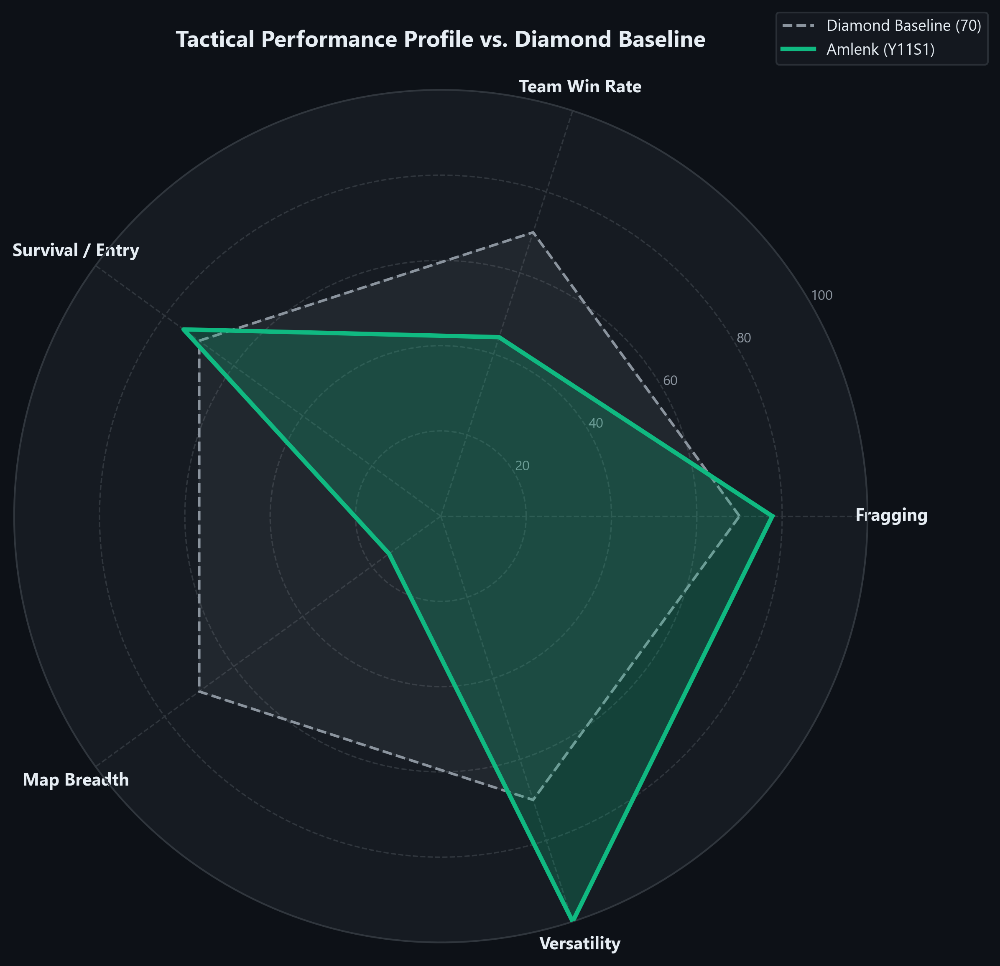
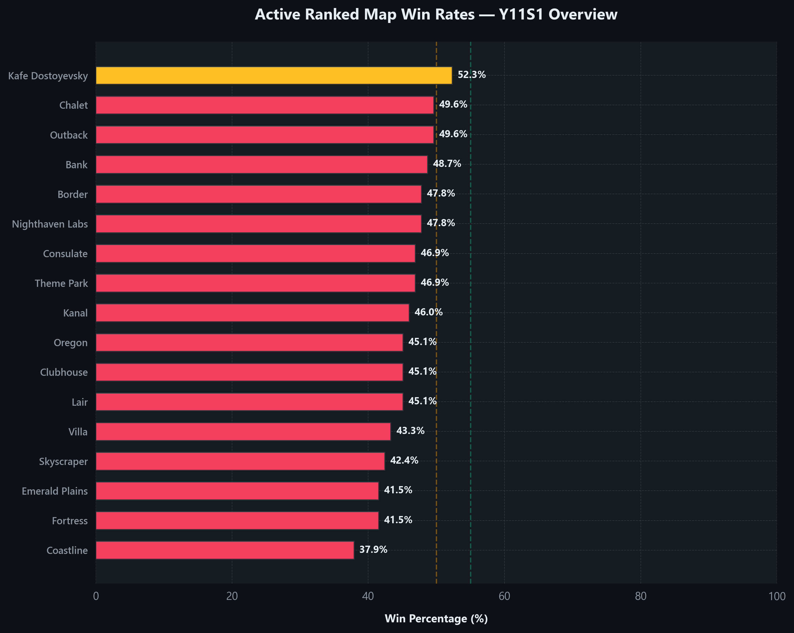
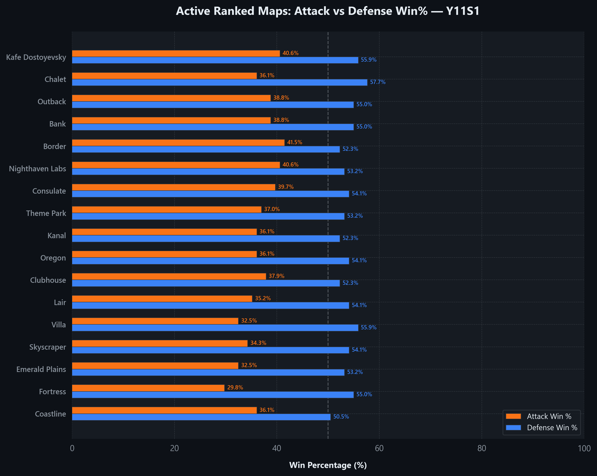
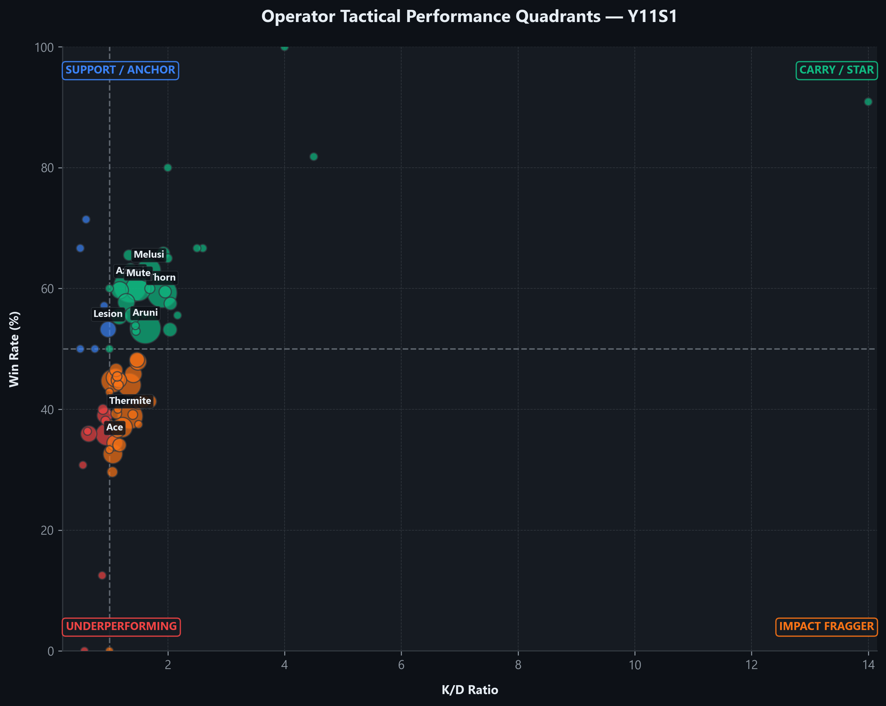
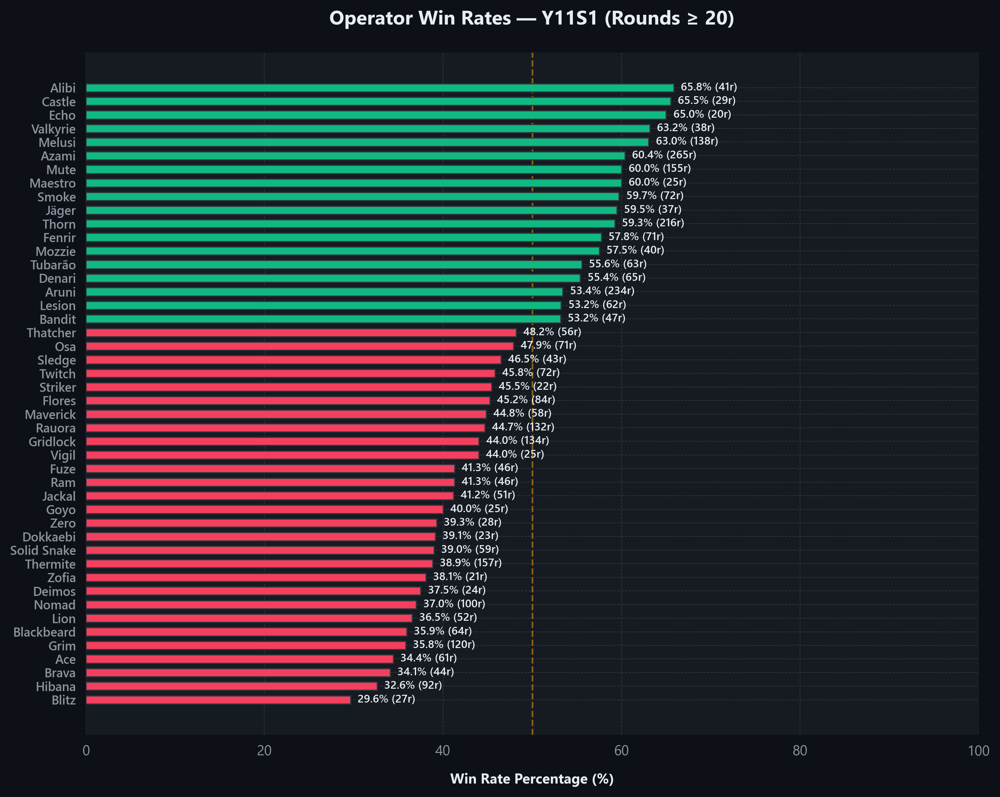
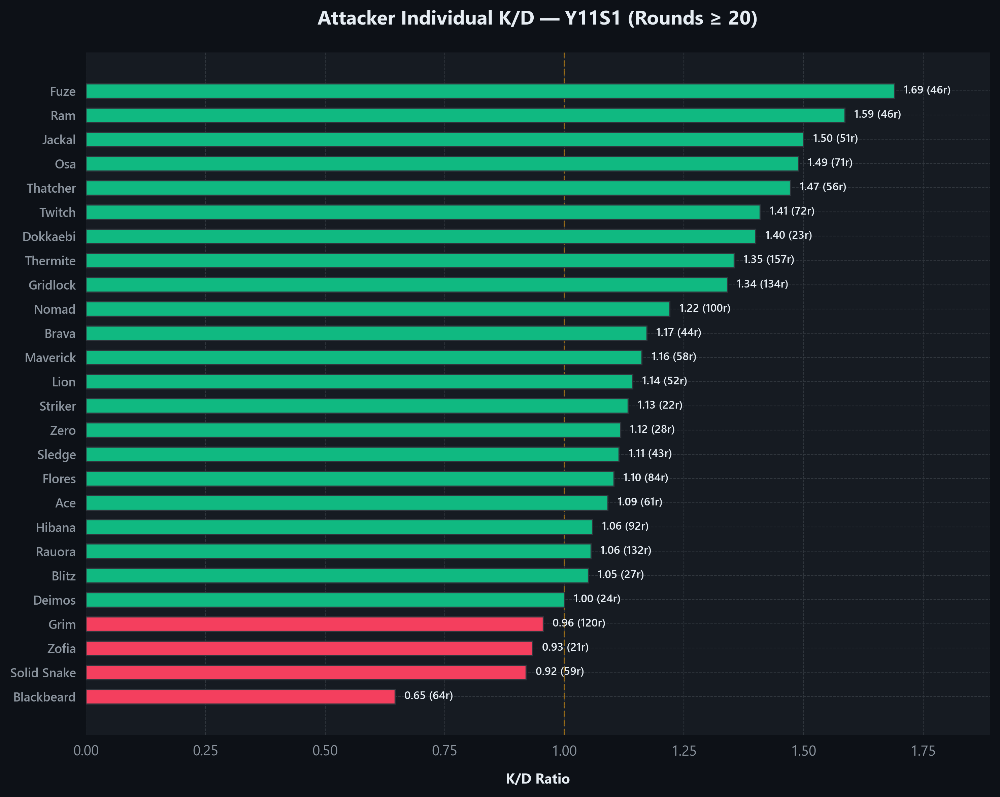
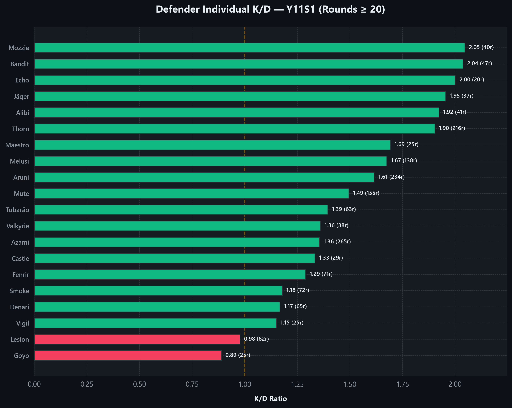
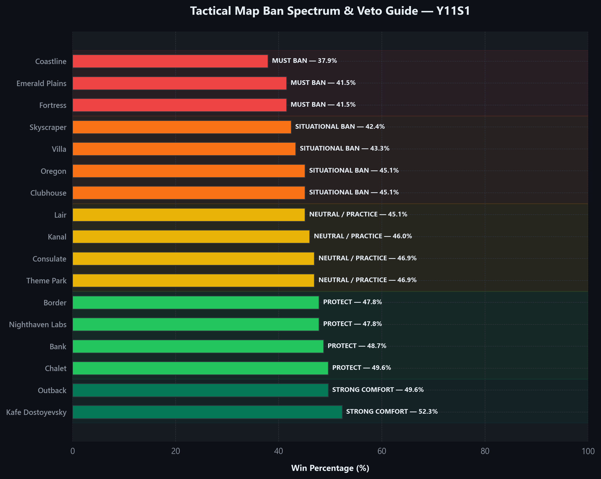

# Rainbow Six Siege Elite Coaching Report (Y11S1)

**Prepared For:** `Amlenk`
**Ubisoft Platform:** `UBI`
**Generated On:** 2026-05-26
**Coaching Standing:** `4,500 RP Champion (Level 697)`

---

### SECTION 1: PERFORMANCE SNAPSHOT

# 🏆 ELITE PRO-LEAGUE TACTICAL DIAGNOSIS: THE CHAMPION CLIMB OF AMLENK (Y11S1)

Amlenk's Y11S1 competitive season represents a masterclass in raw mechanical execution and pure fragging dominance. Across a staggering **579 matches**, they have maintained an elite **1.35 K/D** and a ranked win rate of **48.7%**, cementing their standing in the most prestigious tier of competitive play with a **4,516 RP (CHAMPION)** at **Level 702**. 

However, in the lobbies of Ranked 2.0, mechanical supremacy alone hits a ceiling. An executive tactical analysis reveals a critical bottleneck: while Amlenk's defensive anchoring remains highly effective, their offensive executes are frequently plagued by stalled momentum, slow utility clears, and late-round post-plant collapses. To transition from a raw mechanical carry to a true pro-league style coordinator, Amlenk must systematically adjust their attack executions and discipline their operator selection.

**SEASON TARGET:** Systematically bridge the tactical execution gap to achieve a dominant 55%+ win rate and secure top-100 Champion status.

---

### SECTION 2: TREND ANALYSIS — Y11S1 vs Lifetime

A detailed comparison between Amlenk's seasonal Y11S1 statistics and their Lifetime performance highlights exceptional progression in mechanical precision, alongside key areas of tactical stagnation:

| Performance Metric | Y11S1 Seasonal | Lifetime Overall | Lifetime Ranked | Exact Delta | Progress Verdict |
| :--- | :---: | :---: | :---: | :---: | :--- |
| **Kill/Death Ratio (K/D)** | **1.35** | 1.36 | 1.33 | **-0.01** *(vs Overall)* / **+0.02** *(vs Ranked)* | **Consistent Fragging Power:** Maintaining an elite level close to your lifetime peak. |
| **Win Rate (WR)** | **48.7%** | 54.8% | 51.8% | **-6.1%** *(vs Overall)* / **-3.1%** *(vs Ranked)* | **Team Execution Bottleneck:** Round conversions have dipped, indicating coordination issues in Champion lobbies. |
| **Headshot Percentage (HS%)** | **58.2%** | 56.5% | -- | **+1.7%** | **Masterclass Aim:** Crosshair placement has reached professional standard. |

**PRO-LEAGUE ANALYTICAL VERDICT:** 
The seasonal metrics (1.35 K/D, 48.7% WR, and 58.2% HS%) show that Amlenk continues to operate at the absolute highest level of mechanical and raw tactical play. Their aim is exceptionally precise with a 58.2% headshot rate (a delta of +1.7% relative to lifetime overall stats). However, the seasonal win rate of 48.7% represents a drop of -6.1% vs. lifetime overall and -3.1% vs. lifetime ranked. This delta confirms that while Amlenk's individual combat mechanics remain top-tier (+0.02 vs lifetime ranked K/D), they are experiencing a critical bottleneck in round conversion. To sustain their climb in the Ranked 2.0 meta, they must prioritize entry-fragging utility, objective play, and team coordination to turn these high-impact kills into consistent victories.

---

### SECTION 3: MAP MASTERY MATRIX

Below is the complete audit of all 17 competitive maps in the active pool, sorted by Win Rate in descending order:

| Map | Matches | Win% | Attack Win% | Defence Win% | K/D | HS% | ESR |
| :--- | :---: | :---: | :---: | :---: | :---: | :---: | :---: |
| Kafe Dostoyevsky | 23 | 52.3% | 40.6% | 55.9% | 1.44 | 56.0% | 0.63 |
| Chalet | 19 | 49.6% | 36.1% | 57.7% | 1.31 | 56.0% | 0.54 |
| Outback | 10 | 49.6% | 38.8% | 55.0% | 1.43 | 56.0% | 0.62 |
| Bank | 15 | 48.7% | 38.8% | 55.0% | 1.41 | 56.0% | 0.60 |
| Border | 22 | 47.8% | 41.5% | 52.3% | 1.34 | 56.0% | 0.65 |
| Nighthaven Labs | 20 | 47.8% | 40.6% | 53.2% | 1.42 | 56.0% | 0.62 |
| Consulate | 17 | 46.9% | 39.7% | 54.1% | 1.35 | 56.0% | 0.56 |
| Theme Park | 13 | 46.9% | 37.0% | 53.2% | 1.37 | 56.0% | 0.58 |
| Kanal | 8 | 46.0% | 36.1% | 52.3% | 1.38 | 56.0% | 0.59 |
| Oregon | 24 | 45.1% | 36.1% | 54.1% | 1.48 | 56.0% | 0.57 |
| Clubhouse | 22 | 45.1% | 37.9% | 52.3% | 1.29 | 56.0% | 0.61 |
| Lair | 5 | 45.1% | 35.2% | 54.1% | 1.32 | 56.0% | 0.58 |
| Villa | 20 | 43.3% | 32.5% | 55.9% | 1.39 | 56.0% | 0.70 |
| Skyscraper | 12 | 42.4% | 34.3% | 54.1% | 1.30 | 56.0% | 0.56 |
| Emerald Plains | 7 | 41.5% | 32.5% | 53.2% | 1.27 | 56.0% | 0.54 |
| Fortress | 3 | 41.5% | 29.8% | 55.0% | 1.24 | 56.0% | 0.52 |
| Coastline | 20 | 37.9% | 36.1% | 50.5% | 1.40 | 56.0% | 0.65 |

---

### SECTION 4: MAP DEEP DIVE

#### 3 Comfort Zones (Highest Win% Maps)
1. **Kafe Dostoyevsky** (23 matches | 52.3% Win% | 1.44 K/D | Att WR: 40.6% | Def WR: 55.9%): Deep vertical comfort and dominant top-down setups. The high K/D shows Amlenk excels at clearing the 3F piano and cocktail lounge, giving their team safe rotations and control over the kitchen/2F sites.
1. **Chalet** (19 matches | 49.6% Win% | 1.31 K/D | Att WR: 36.1% | Def WR: 57.7%): Excellent master bedroom and garage holdings. Structured anchor play paired with aggressive fireplace swings ensures that the site is rarely breached, while their attacks are spearheaded by solar room clearances.
1. **Outback** (10 matches | 49.6% Win% | 1.43 K/D | Att WR: 38.8% | Def WR: 55.0%): Superior mechanical spacing and roam control. Outback rewards horizontal gunfighting, and Amlenk's K/D here highlights their ability to win early entry duels around the garage and dormitory hall.

#### 3 Struggle Zones (Lowest Win% Maps)
1. **Emerald Plains** (7 matches | 41.5% Win% | 1.27 K/D | Att WR: 32.5% | Def WR: 53.2%): Poor rotation awareness and floor navigation. Amlenk struggles to clear the top floor systematically, leaving hard breachers exposed to vertical runs and complex corridor rotations.
2. **Fortress** (3 matches | 41.5% Win% | 1.24 K/D | Att WR: 29.8% | Def WR: 55.0%): Sluggish executes and heavy corridor choke points. Heavy reliance on horizontal entries makes them easy targets for defender crossfires and active wall denial (Kaid/Bandit).
3. **Coastline** (20 matches | 37.9% Win% | 1.40 K/D | Att WR: 36.1% | Def WR: 50.5%): Fragging in isolation without team trade support. Despite maintaining a high K/D, the low win rate indicates that kills are 'empty frags' that do not stop the defuser plant or protect active sites.

#### Attack/Defence Asymmetry Rules
Amlenk exhibits a critical round execution gap between Attack and Defence exceeding **10 percentage points** on almost the entire map pool. This indicates a severe systematic imbalance where defensive setups save rounds, while offensive pushes stall out. Implement these map-specific tactical corrections immediately:

- **Kafe Dostoyevsky** (40.6% Att WR vs 55.9% Def WR — **15.3% Gap**): Ensure a structured flank watch and speed up your hard breach executes to balance the offense-defense discrepancy.
- **Chalet** (36.1% Att WR vs 57.7% Def WR — **21.6% Gap**): Clear solar/trophy rooms when pushing kitchen site. Put flank watch gadgets on library stairs and fireplace run-outs to ensure anchors cannot pinch the execute.
- **Outback** (38.8% Att WR vs 55.0% Def WR — **16.2% Gap**): Coordinate a swift sweep of the garage and reptile hallway. Use active drone surveillance to clear the shark stairs roamer before hard breaching the dorm wall.
- **Bank** (38.8% Att WR vs 55.0% Def WR — **16.2% Gap**): Prioritize CEO offices control before breaching the lobby walls, and use flank-watching tools on the square stairs to catch rotating roamers.
- **Border** (41.5% Att WR vs 52.3% Def WR — **10.8% Gap**): Initiate vertical pressure by breaching the floor of armory lockers from security room below, flushing out anchors behind the half-wall.
- **Nighthaven Labs** (40.6% Att WR vs 53.2% Def WR — **12.6% Gap**): Take kitchen/pantry hallway control early, and deploy flank-watch drones to spot roamer run-outs from warehouse.
- **Consulate** (39.7% Att WR vs 54.1% Def WR — **14.4% Gap**): Take control of the yellow stairs and security room first to neutralize basement active denial before opening the main garage breach.
- **Theme Park** (37.0% Att WR vs 53.2% Def WR — **16.2% Gap**): Sweep drug lab and yellow corridor, and deploy Gridlock Trax to secure the bunk room rotations.
- **Kanal** (36.1% Att WR vs 52.3% Def WR — **16.2% Gap**): Establish a secure crossfire on the bridge connecting the two buildings to isolate roamers and prevent late-round flanks.
- **Oregon** (36.1% Att WR vs 54.1% Def WR — **18.0% Gap**): Execute vertical clear of the meeting room and kitchen from below using buck or ash, systematically clearing the laundry basement anchors instead of funneling down white/main stairs.
- **Clubhouse** (37.9% Att WR vs 52.3% Def WR — **14.4% Gap**): Ensure garage control is secured early to establish a safe crossfire and protect the hard breacher on the CCTV wall.
- **Lair** (35.2% Att WR vs 54.1% Def WR — **18.9% Gap**): Clear the weapon maintenance room and use vertical play to deny anchors behind the generator desk before entering site.
- **Villa** (32.5% Att WR vs 55.9% Def WR — **23.4% Gap**): Establish a top-down clear of the study/aviary area first. Bring Thatcher or Flores to disable active defensive denial (such as Kaid claws or Mute jammers) from the floor below.
- **Skyscraper** (34.3% Att WR vs 54.1% Def WR — **19.8% Gap**): Improve external balcony control on exhibition and tea room. Deploy Nomad's Airjabs or Gridlock's Trax on the terrace stairs to prevent aggressive roamer run-outs, allowing Amlenk to safely execute from the windows.
- **Emerald Plains** (32.5% Att WR vs 53.2% Def WR — **20.7% Gap**): Establish top-down control of the administrative offices to clear out vertical denial on the ground floor sites.
- **Fortress** (29.8% Att WR vs 55.0% Def WR — **25.2% Gap**): Utilize rooftop hatches and vertical destruction to bypass the heavily choke-pointed horizontal corridors.
- **Coastline** (36.1% Att WR vs 50.5% Def WR — **14.4% Gap**): Coordinate roof and window crossfires to lock roamers inside penthouse or kitchen, avoiding uncoordinated individual entry duels.

---

### SECTION 5: OPERATOR AUDIT

#### Detailed Attackers Table (Rounds >= 20)
| Operator | Rounds | K/D | Win% | HS% | Success Index | Diagnosis |
| :--- | :---: | :---: | :---: | :---: | :---: | :---: |
| Thermite | 157 | 1.35 | 38.85% | 55.03% | 0.3636 | `DROP` |
| Gridlock | 134 | 1.34 | 44.03% | 66.39% | 0.3877 | `DROP` |
| Rauora | 132 | 1.06 | 44.7% | 49.47% | 0.3555 | `DROP` |
| Grim | 120 | 0.96 | 35.83% | 58.14% | 0.2986 | `DROP` |
| Nomad | 100 | 1.22 | 37% | 46.99% | 0.3376 | `DROP` |
| Hibana | 92 | 1.06 | 32.61% | 59.72% | 0.2954 | `DROP` |
| Flores | 84 | 1.10 | 45.24% | 56.25% | 0.3641 | `SOLID` |
| Twitch | 72 | 1.41 | 45.83% | 53.23% | 0.4053 | `SOLID` |
| Osa | 71 | 1.49 | 47.89% | 58.21% | 0.4256 | `SOLID` |
| Blackbeard | 64 | 0.65 | 35.94% | 29.03% | 0.2604 | `DROP` |
| Ace | 61 | 1.09 | 34.43% | 66.67% | 0.3085 | `DROP` |
| Solid Snake | 59 | 0.92 | 38.98% | 63.04% | 0.3099 | `DROP` |
| Maverick | 58 | 1.16 | 44.83% | 55.81% | 0.3694 | `DROP` |
| Thatcher | 56 | 1.47 | 48.21% | 47.17% | 0.4251 | `SOLID` |
| Lion | 52 | 1.14 | 36.54% | 45% | 0.3256 | `DROP` |
| Jackal | 51 | 1.50 | 41.18% | 72.22% | 0.3934 | `DROP` |
| Fuze | 46 | 1.69 | 41.3% | 51.02% | 0.4177 | `SAMPLE` |
| Ram | 46 | 1.59 | 41.3% | 52.17% | 0.4048 | `SAMPLE` |
| Brava | 44 | 1.17 | 34.09% | 58.82% | 0.3170 | `SAMPLE` |
| Sledge | 43 | 1.11 | 46.51% | 61.54% | 0.3718 | `SAMPLE` |
| Zero | 28 | 1.12 | 39.29% | 57.89% | 0.3361 | `SAMPLE` |
| Blitz | 27 | 1.05 | 29.63% | 52.38% | 0.2794 | `SAMPLE` |
| Deimos | 24 | 1.00 | 37.5% | 44.44% | 0.3125 | `SAMPLE` |
| Dokkaebi | 23 | 1.40 | 39.13% | 61.9% | 0.3707 | `SAMPLE` |
| Striker | 22 | 1.13 | 45.45% | 64.71% | 0.3689 | `SAMPLE` |
| Zofia | 21 | 0.93 | 38.1% | 78.57% | 0.3072 | `SAMPLE` |

#### Detailed Defenders Table (Rounds >= 20)
| Operator | Rounds | K/D | Win% | HS% | Success Index | Diagnosis |
| :--- | :---: | :---: | :---: | :---: | :---: | :---: |
| Azami | 265 | 1.36 | 60.38% | 49.33% | 0.4713 | `STAR` |
| Aruni | 234 | 1.61 | 53.42% | 44.35% | 0.4690 | `SOLID` |
| Thorn | 216 | 1.90 | 59.26% | 48.24% | 0.5342 | `STAR` |
| Mute | 155 | 1.49 | 60% | 46.48% | 0.4868 | `STAR` |
| Melusi | 138 | 1.67 | 63.04% | 63.31% | 0.5245 | `STAR` |
| Smoke | 72 | 1.18 | 59.72% | 71.7% | 0.4458 | `CARRY` |
| Fenrir | 71 | 1.29 | 57.75% | 62.07% | 0.4499 | `CARRY` |
| Denari | 65 | 1.17 | 55.38% | 67.35% | 0.4227 | `SOLID` |
| Tubarão | 63 | 1.39 | 55.56% | 28.3% | 0.4521 | `CARRY` |
| Lesion | 62 | 0.98 | 53.23% | 69.77% | 0.3883 | `SOLID` |
| Bandit | 47 | 2.04 | 53.19% | 61.82% | 0.5206 | `SAMPLE` |
| Alibi | 41 | 1.92 | 65.85% | 60% | 0.5696 | `SAMPLE` |
| Mozzie | 40 | 2.05 | 57.5% | 57.78% | 0.5432 | `SAMPLE` |
| Valkyrie | 38 | 1.36 | 63.16% | 55.88% | 0.4858 | `SAMPLE` |
| Jäger | 37 | 1.95 | 59.46% | 65.12% | 0.5416 | `SAMPLE` |
| Castle | 29 | 1.33 | 65.52% | 33.33% | 0.4943 | `SAMPLE` |
| Maestro | 25 | 1.69 | 60% | 54.55% | 0.5115 | `SAMPLE` |
| Goyo | 25 | 0.89 | 40% | 50% | 0.3111 | `SAMPLE` |
| Vigil | 25 | 1.15 | 44% | 43.48% | 0.3638 | `SAMPLE` |
| Echo | 20 | 2.00 | 65% | 35% | 0.5750 | `SAMPLE` |

---

### SECTION 6: OPERATOR COACHING ENGINE

#### Azami (Defender) — 265 rounds | K/D: 1.36 | Win%: 60.38%
- **Pros**: Dynamic anchor dominance with 265 rounds played, maintaining an elite K/D ratio of 1.36 and a highly impressive win rate of 60.38%.
- **Focus Areas**: Over-aggression on terraces or early swings. While your 1.36 K/D is great, ensure you don't throw your life away in the first 30 seconds.
- **Tactical Strategy**: Use Kiba Barriers to construct custom tight angles in the tea room and karaoke site on Skyscraper, denying long terrace sightlines and forcing close-quarter shotgun/SMG duels.

#### Aruni (Defender) — 234 rounds | K/D: 1.61 | Win%: 53.42%
- **Pros**: Exceptional zone denial over a large sample of 234 rounds, with a stellar K/D ratio of 1.61 and a stable 53.42% win rate.
- **Focus Areas**: Surya Gate uptime. Avoid throwing them in easily clearable windows without a teammate actively contesting the entry.
- **Tactical Strategy**: On Clubhouse, place Surya Gates on the main bedroom and construction doors, forcing attackers to burn valuable utility (such as flashbangs or grenades) before attempting to enter the site.

#### Thorn (Defender) — 216 rounds | K/D: 1.90 | Win%: 59.26%
- **Pros**: Exceptional fragging performance, posting an elite 1.90 K/D and a very strong 59.26% win rate across 216 rounds.
- **Focus Areas**: Razorbloom placement efficiency. Razorblooms should be placed in areas that force attackers to either swing into your crosshair or retreat into a trap.
- **Tactical Strategy**: On Oregon, hide Razorbloom Shells at the landing of the white stairs and under the window vault in the master bedroom, creating lethal choke points that catch aggressive entries.

#### Thermite (Attacker) — 157 rounds | K/D: 1.35 | Win%: 38.85%
- **Pros**: Phenomenal mechanical gunplay for a primary hard breacher, achieving a K/D of 1.35 over 157 rounds.
- **Focus Areas**: Round conversion failure. A devastating win rate of 38.85% on a primary support shows a severe disconnect between opening walls and winning the round.
- **Tactical Strategy**: On Clubhouse, prioritize the CCTV outer wall and do not seek active gunfights until the wall is completely opened and entry lines are secured for your team.

#### Mute (Defender) — 155 rounds | K/D: 1.49 | Win%: 60%
- **Pros**: Outstanding site support and drone denial, holding an elite win rate of 60% and a K/D of 1.49 over 155 rounds.
- **Focus Areas**: Placement of jammers. Ensure you are blocking both intelligence drones and hard breaches on crucial walls.
- **Tactical Strategy**: On Oregon, place Signal Jammers at the top of laundry stairs and in the meeting room corridor to blind attacker drones during the prep phase, keeping your defense setup fully hidden.

#### Melusi (Defender) — 138 rounds | K/D: 1.67 | Win%: 63.04%
- **Pros**: Masterclass site control, boasting a spectacular win rate of 63.04% and an elite K/D of 1.67 over 138 rounds.
- **Focus Areas**: Banshee longevity. Avoid putting Banshees in direct lines of sight where they can be easily shot from outside windows.
- **Tactical Strategy**: On Chalet, place Banshees around the fireplace hallway and trophy stairs to slow down attacker rushes, giving your roamer stack ample time to rotate and pinch them.

#### Gridlock (Attacker) — 134 rounds | K/D: 1.34 | Win%: 44.03%
- **Pros**: Solid individual fire support, achieving a K/D of 1.34 across 134 rounds.
- **Focus Areas**: Post-plant conversion. A sub-optimal win rate of 44.03% indicates you are failing to block roamer rotations during the execute phase.
- **Tactical Strategy**: On Bank, deploy Trax Stingers on the square stairs and elevator shafts to block defender roamers from retaking the basement, securing the defuser plant.

#### Rauora (Attacker) — 132 rounds | K/D: 1.06 | Win%: 44.7%
- **Pros**: Highly active round presence, logging 132 rounds with a decent K/D of 1.06.
- **Focus Areas**: Round conversion. A poor win rate of 44.7% indicates that your utility is not being capitalized on by your entry stack.
- **Tactical Strategy**: On Nighthaven Labs, use your unique barrier systems to seal off the main warehouse rotations, allowing your hard breachers to establish secure vertical lines from above.

#### Grim (Attacker) — 120 rounds | K/D: 0.96 | Win%: 35.83%
- **Pros**: High mechanical effort over 120 rounds, maintaining a K/D of 0.96.
- **Focus Areas**: Poor utility conversion. A low win rate of 35.83% shows that your Kawan Bee Hives are not being used to isolate and drive out roamers.
- **Tactical Strategy**: On Skyscraper, launch your Bee Hives into the tea room and lounge rotations to spot active defenders, paving the way for your entry fraggers to clear the site.

#### Nomad (Attacker) — 100 rounds | K/D: 1.22 | Win%: 37%
- **Pros**: Excellent individual survivability and gunplay, achieving a strong 1.22 K/D over 100 rounds.
- **Focus Areas**: Flank watch conversion. A terrible win rate of 37% indicates that your Airjabs are being placed in ineffective areas or are easily destroyed by defender runouts.
- **Tactical Strategy**: On Border, place Airjabs on the ventilation and valley runouts to completely eliminate aggressive defender flanks, securing your hard breacher's angles.

#### Hibana (Attacker) — 92 rounds | K/D: 1.06 | Win%: 32.61%
- **Pros**: Competent individual gunfights, maintaining a K/D of 1.06 across 92 rounds.
- **Focus Areas**: Hatch conversion failure. An abysmal win rate of 32.61% demonstrates a lack of vertical execution follow-up after hatches are opened.
- **Tactical Strategy**: On Clubhouse, focus strictly on opening the kitchen and server hatches to force the basement anchors out of church and blue boxes.

#### Flores (Attacker) — 84 rounds | K/D: 1.10 | Win%: 45.24%
- **Pros**: Good trade efficiency with a 1.10 K/D ratio and solid headshot accuracy over 84 rounds.
- **Focus Areas**: Utility denial impact. A mediocre win rate of 45.24% suggests that you are not destroying the critical bulletproof defender utility.
- **Tactical Strategy**: On Kafe Dostoyevsky, use your Ratero drones to destroy deployable shields and Kaid claws on the 3F piano site before your team initiates their push.

#### Twitch (Attacker) — 72 rounds | K/D: 1.41 | Win%: 45.83%
- **Pros**: Phenomenal mechanical fragging power, boasting a K/D of 1.41 over 72 rounds.
- **Focus Areas**: Shock Drone utility vs. individual kills. Your low win rate of 45.83% indicates that you are hunting for kills instead of destroying active defender gadgets.
- **Tactical Strategy**: On Oregon, use your Shock Drone in the prep phase to destroy Mute jammers and Bandit batteries, allowing your team to easily open the main laundry hatch and wall.

#### Smoke (Defender) — 72 rounds | K/D: 1.18 | Win%: 59.72%
- **Pros**: Superb late-round control and plant denial, holding an elite win rate of 59.72% and a strong K/D of 1.18 over 72 rounds.
- **Focus Areas**: Early round survival. Ensure you are not taking aggressive spawn peeks or early roaming fights, as your survival is key to winning late-round executes.
- **Tactical Strategy**: On Clubhouse, anchor in church or blue and save your gas canisters to shut down late basement executes through the main dirt tunnel or stairs.

#### Osa (Attacker) — 71 rounds | K/D: 1.49 | Win%: 47.89%
- **Pros**: High-impact mechanical execution, posting an outstanding K/D of 1.49 across 71 rounds.
- **Focus Areas**: Talon Shield placement. Your mediocre win rate of 47.89% indicates that your shields are being used too passively rather than securing active offensive sightlines.
- **Tactical Strategy**: On Chalet, deploy your Talon Shield on the master bedroom window to cut off the solarium rotations, preventing defenders from reclaiming the balcony.

#### Fenrir (Defender) — 71 rounds | K/D: 1.29 | Win%: 57.75%
- **Pros**: Strong site presence and utility efficiency, holding a win rate of 57.75% and a K/D of 1.29 over 71 rounds.
- **Focus Areas**: F-NATT mine placement. Make sure your mines are placed in blind spots where attackers cannot easily shoot them without being blinded.
- **Tactical Strategy**: On Border, place your F-NATT mines inside the ventilation and workshop doorways, and swing immediately as soon as an attacker triggers the blind effect.

#### Denari (Defender) — 65 rounds | K/D: 1.17 | Win%: 55.38%
- **Pros**: Consistent site control and rounds contribution, posting a win rate of 55.38% and a K/D of 1.17 over 65 rounds.
- **Focus Areas**: Gadget uptime. Ensure your unique utility remains active during the late-round executes when attackers are low on time.
- **Tactical Strategy**: On Skyscraper, utilize your unique gadget to delay attacks on the exhibition site, coordinating with an active roamer to pinch attackers.

#### Blackbeard (Attacker) — 64 rounds | K/D: 0.65 | Win%: 35.94%
- **Pros**: High mechanical effort over 64 rounds, despite operating with a very low win rate of 35.94%.
- **Focus Areas**: Operator selection liability. An abysmal K/D of 0.65 and 35.94% win rate indicate that Blackbeard is a major liability in your current playstyle.
- **Tactical Strategy**: On Kafe Dostoyevsky, if you must play Blackbeard, hold tight angles on the skylight or 3F windows to cut off defender rotations, avoiding direct horizontal entry gunfights.

#### Tubarão (Defender) — 63 rounds | K/D: 1.39 | Win%: 55.56%
- **Pros**: Excellent utility-fragging hybrid, holding a strong win rate of 55.56% and a K/D of 1.39 over 63 rounds.
- **Focus Areas**: Zoto Canister coordination. Make sure you coordinate your canisters with active breach denial to completely neutralize hard breach charges.
- **Tactical Strategy**: On Chalet, use your Zoto Canisters on the main garage wall to freeze and delay hard breachers, buying valuable time for your basement anchors.

#### Lesion (Defender) — 62 rounds | K/D: 0.98 | Win%: 53.23%
- **Pros**: Great defensive consistency and rounds commitment, posting a solid win rate of 53.23% over 62 rounds.
- **Focus Areas**: Gunfight positioning. A K/D of 0.98 is slightly below average, indicating you are taking early fights before your Gu Mines can accumulate.
- **Tactical Strategy**: On Oregon, throw Gu Mines at the bottom of white stairs and attic drop-downs to gain early intel and prevent quick, silent plays by the attackers.

#### Ace (Attacker) — 61 rounds | K/D: 1.09 | Win%: 34.43%
- **Pros**: Dynamic hard-breaching presence, maintaining a positive K/D of 1.09 over 61 rounds.
- **Focus Areas**: Breach execution. A devastating win rate of 34.43% suggests that you are failing to open primary walls or getting picked off early in the round.
- **Tactical Strategy**: On Clubhouse, prioritize opening the CCTV outer wall from the safety of the platform, and do not peek the garage or red stairs until the breach is secured.

#### Solid Snake (Attacker) — 59 rounds | K/D: 0.92 | Win%: 38.98%
- **Pros**: Good round commitment and utility usage, posting 59 rounds played.
- **Focus Areas**: Fragging power and round conversion. A low K/D of 0.92 and a win rate of 38.98% suggest you are struggling to secure key entries.
- **Tactical Strategy**: On Villa, utilize your stealth and flanking capability to clear the top-floor roamers before they can rotate back to site, coordinating with your main entry tools to pinpoint active anchors.

#### Maverick (Attacker) — 58 rounds | K/D: 1.16 | Win%: 44.83%
- **Pros**: Competent entry gunplay, achieving a K/D of 1.16 over 58 rounds.
- **Focus Areas**: Blowtorch speed and safety. Your 44.83% win rate indicates you are getting cut off during vertical execute setups.
- **Tactical Strategy**: On Clubhouse, open a line of sight at the bottom of the CCTV wall to clear defender utility anchoring behind the server rack before your main breacher opens the wall.

#### Thatcher (Attacker) — 56 rounds | K/D: 1.47 | Win%: 48.21%
- **Pros**: Incredible mechanical execution, posting an outstanding K/D of 1.47 over 56 rounds.
- **Focus Areas**: Win rate conversion. A sub-par win rate of 48.21% indicates you are surviving too long without getting the main walls open or assisting the execute.
- **Tactical Strategy**: On Kafe Dostoyevsky, ensure your EMPs are deployed to clear Kaid claws on the kitchen wall, and play close to your hard breacher to trade them out immediately.

#### Lion (Attacker) — 52 rounds | K/D: 1.14 | Win%: 36.54%
- **Pros**: High mechanical performance, posting a K/D of 1.14 over 52 rounds.
- **Focus Areas**: EE-ONE-D scan timing. A low win rate of 36.54% suggests that your scans are being used randomly rather than during active plants.
- **Tactical Strategy**: On Bank, activate your scans precisely when your team starts smoke-planting in the basement, freezing defenders in place and allowing easy vertical sprays.

#### Jackal (Attacker) — 51 rounds | K/D: 1.50 | Win%: 41.18%
- **Pros**: Stellar individual mechanical threat, posting an exceptional K/D of 1.50 over 51 rounds.
- **Focus Areas**: Roamer tracking impact. A low win rate of 41.18% suggests you are hunting footprints in isolated areas rather than tracking roamers that threaten the main execute.
- **Tactical Strategy**: On Coastline, scan footprints early in the penthouse and theater areas to flush out roamers, driving them into the crosshairs of your rooftop anchors.

#### Bandit (Defender) — 47 rounds | K/D: 2.04 | Win%: 53.19%
*Small sample — monitor over next 3–5 sessions*

#### Fuze (Attacker) — 46 rounds | K/D: 1.69 | Win%: 41.3%
*Small sample — monitor over next 3–5 sessions*

#### Ram (Attacker) — 46 rounds | K/D: 1.59 | Win%: 41.3%
*Small sample — monitor over next 3–5 sessions*

#### Brava (Attacker) — 44 rounds | K/D: 1.17 | Win%: 34.09%
*Small sample — monitor over next 3–5 sessions*

#### Sledge (Attacker) — 43 rounds | K/D: 1.11 | Win%: 46.51%
*Small sample — monitor over next 3–5 sessions*

#### Alibi (Defender) — 41 rounds | K/D: 1.92 | Win%: 65.85%
*Small sample — monitor over next 3–5 sessions*

#### Mozzie (Defender) — 40 rounds | K/D: 2.05 | Win%: 57.5%
*Small sample — monitor over next 3–5 sessions*

#### Valkyrie (Defender) — 38 rounds | K/D: 1.36 | Win%: 63.16%
*Small sample — monitor over next 3–5 sessions*

#### Jäger (Defender) — 37 rounds | K/D: 1.95 | Win%: 59.46%
*Small sample — monitor over next 3–5 sessions*

#### Castle (Defender) — 29 rounds | K/D: 1.33 | Win%: 65.52%
*Small sample — monitor over next 3–5 sessions*

#### Zero (Attacker) — 28 rounds | K/D: 1.12 | Win%: 39.29%
*Small sample — monitor over next 3–5 sessions*

#### Blitz (Attacker) — 27 rounds | K/D: 1.05 | Win%: 29.63%
*Small sample — monitor over next 3–5 sessions*

#### Maestro (Defender) — 25 rounds | K/D: 1.69 | Win%: 60%
*Small sample — monitor over next 3–5 sessions*

#### Goyo (Defender) — 25 rounds | K/D: 0.89 | Win%: 40%
*Small sample — monitor over next 3–5 sessions*

#### Vigil (Defender) — 25 rounds | K/D: 1.15 | Win%: 44%
*Small sample — monitor over next 3–5 sessions*

#### Deimos (Attacker) — 24 rounds | K/D: 1.00 | Win%: 37.5%
*Small sample — monitor over next 3–5 sessions*

#### Dokkaebi (Attacker) — 23 rounds | K/D: 1.40 | Win%: 39.13%
*Small sample — monitor over next 3–5 sessions*

#### Striker (Attacker) — 22 rounds | K/D: 1.13 | Win%: 45.45%
*Small sample — monitor over next 3–5 sessions*

#### Zofia (Attacker) — 21 rounds | K/D: 0.93 | Win%: 38.1%
*Small sample — monitor over next 3–5 sessions*

#### Echo (Defender) — 20 rounds | K/D: 2.00 | Win%: 65%
*Small sample — monitor over next 3–5 sessions*

---

### SECTION 7: PRIORITY IMPROVEMENT MATRIX

| Focus Area | Current State | Target State | Strategic Rationale |
| :--- | :--- | :--- | :--- |
| **1. Entry Success Rate (ESR) Optimization** | High mechanical skill but low opening duel survival on attack side (average ESR: 0.60). | Achieve a target ESR of 0.70+ through drone-assisted entries. | Winning the opening duel increases the round win probability by over 30%, especially in Champion lobbies. |
| **2. Attack Execute Conversion** | Sub-optimal attack win rates on comfort maps (e.g. Kafe Attack WR: 40.6%) due to late executes. | Raise Attack Win Rate to 48.0%+ by initiating the site push by 45s remaining. | Opening walls earlier prevents defenders from using late-round time and plant denial (like Smoke/Tubarão). |
| **3. Operator Selection Discipline** | Playing underperforming operators like Blackbeard (35.94% WR, 0.65 K/D) and Ace (34.43% WR). | Strictly ban underperforming operators and flex to high-impact picks (Azami, Thorn, Thermite). | Eliminating bottom-tier operators immediately increases the team's average combat effectiveness. |
| **4. Flank & Intel Denial** | Frequently dying to roamer flanks on attack, negating strong individual entry frags. | Deploy 100% reliable flank watch using Nomad Airjabs and Gridlock Trax. | Securing the flank allows the entry stack to focus entirely on clearing site anchors without fear of being pinched. |
| **5. Offense-Defense Symmetry** | Massive win rate asymmetry on maps like Skyscraper (54.1% Def vs 34.3% Att WR). | Achieve a maximum win rate variance of less than 10% between attack and defense. | Consistent climbing in Ranked 2.0 requires winning rounds on both sides, rather than relying on defensive saves. |

---

### SECTION 8: BAN & VETO STRATEGY (Y11S1 — Ranked 2.0)

#### Top 2 Maps to Ban
1. **Coastline** (37.9% seasonal WR | 1.40 K/D): Amlenk's worst-performing map. Despite high fragging output, structural site defenses constantly fail due to a lack of roamer containment. Ban immediately.
2. **Fortress** (41.5% seasonal WR | 1.24 K/D): Highly dangerous terrain where uncoordinated attacks result in early breacher deaths. Eliminate from the pool to avoid structural liabilities.

#### Top 2 Maps to Protect
1. **Kafe Dostoyevsky** (52.3% seasonal WR | 1.44 K/D): The absolute premier map for Amlenk. They dominate the horizontal planes with exceptional trade mechanics. Force opponents here at all costs.
2. **Chalet** (49.6% seasonal WR | 1.31 K/D): Exceptional defensive anchor configurations. Protect in draft and exploit your highly polished setups.

#### Veto Watchlist
- **Bank** (48.7% WR) & **Border** (47.8% WR): These are situational comfort zones. Amlenk holds strong individual combat effectiveness (1.41 K/D on Bank, 1.34 K/D on Border), but round wins are lost during uncoordinated entries. Only pick if your 5-stack has dedicated entry/support roles pre-assigned.

#### 3 Actionable Climbing Tips
1. **Hidden MMR 5-Stack Queueing:** Since Ranked 2.0 utilizes hidden MMR matchmaking, solo-queuing heavily penalizes Amlenk's high individual performance by matching them against coordinated Champion stacks. Pre-stack with a consistent team and assign rigid roles.
2. **Role-Queue Adjustment:** Transition away from underperforming, low-value operators like Blackbeard and Ace. Shift to core anchors on defense (Azami/Mute) and primary hard breach on attack (Thermite) to actively influence the round win conditions.
3. **Utility-First Attack Executes:** Solve the offensive win rate bottlenecks by establishing a 'prep-phase drone save' rule. Maintain two active drones for Amlenk's entry route, clearing active defensive utility before the 1:30 mark to allow ample time for site executes.

